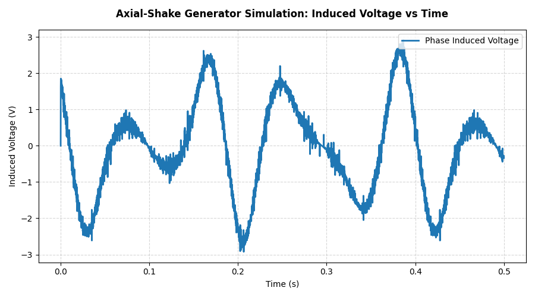

  
   
  <em> Axial Shake Powered Pill Dispenser – Electromechanical Design by <a href="https://github.com/wgbowley">William Bowley</a></em>

## Overview

The Hercules Challenge is a co-design consortium challenge available for first-year engineers through the mandatory introductory class, "Introduction to Professional Engineering." The idea behind the Hercules Challenge is to introduce humanitarian engineering to students who might otherwise never consider it.

## Pillarator

The `Pillarator` is a pill dispenser built around an axial shake generator, meaning it relies on no external power. It uses six bi-sectors to store `Size 1` pills and a sorting mechanism to dispense a combination into a cup. The head of the dispenser is a `~200mL` water bottle, with the bottom serving as the medication cup.

The `Pillarator` does have a Li-Po battery to store excess power generated when shaking the device. This allows it to keep a low-powered `crystal oscillator` running to provide user alerts via an internal `taptic engine` or the device's mobile application alerts.

## Axial Shake Generator
<figure align="center">
  
  <figcaption>
    Figure 1: Cross-sectional analysis:
    <a href="poc_axial_generator\parameters.uiv"><i>Click here model for parameters</i></a>
  </figcaption>
</figure>

The generator uses `Faraday's Law of Induction`, which states that the rate of change of flux linkage over time produces an `opposing voltage` to the direction of motion. To harness this effect, the generator stator has `10` coils with alternating winding directions. The generator's armature has `5` N52 magnets in an `N-N-S-S-N` orientation; the armature also has two conical compression springs acting on it, which form a system of equilibrium. This allows for small forces on the armature to cause a damped sine-wave motion rather than a single pulse.

<figure align="center">
  
  <figcaption>
    Figure 2: Generator induced voltage output vs time:
    <a href="poc_axial_generator\FEM\main.py"><i>Click here for pyFEA code</i></a>
  </figcaption>
</figure>

To improve the generator's output, I modeled thin `0.2mm` iron laminations to help direct the flux within the internal cavity; however, this addition could not be simulated due to time restrictions. It is, however, supported by:

$$V_{\text{induced}} = -\frac{d\lambda}{dz} \cdot \frac{dz}{dt} \implies -\frac{d\lambda}{dt}$$

$$\lambda(z) \propto \frac{N^2 \mu(z) A}{l} \implies \lambda(z) \propto \mu(z)$$

## Pill Mechanism

This was surprisingly complex conceptually, it is just sorting cylinders, but it was difficult due to the space limitations of the device and the massive variation in pill size. It was a surprisingly hard challenge that I did not solve for the Hercules Challenge alpha prototype submission, though work began four days before the submission date for this mechanism. Hence, if the group were to continue, this would be the next actionable piece to prototype and get working.

# Credits:

My general conclusion is that we had "Great execution, Questionable Vision." It really shows how humanitarian engineering is driven more by the problem space, with technical ability being an enabler, not the primary solution.

### Group Members:
* Anna Bowley - Thank you for introducing me to this wonderful set of individuals. It was a pleasure working with you.
* Rory Smith - Generally, it was a pleasure working with you; you are very charismatic, and I wish I had your Blender skills.
* Vedica Chhabra - You were perhaps the most locked-in member of the group, at least in my opinion. Thanks.
* Dhanvin Shingri Sunil Kumar - Even though I didn't have much to do with you, you seemed generally on the ball, and if you ever want to join the race team, let me know.
* Jaspreet Kaur Kingra - You were our "research gremlin," even though I mostly heard the compressed conclusions from my sister. I generally appreciate it.
* Jazzi Alderton - Thank you for helping me improve my team management skills. Probably the most impactful contribution. Thanks again.

### Honourable Mentions

* Lawson Gallup - Thanks for 3D printing the `POC` model overnight, and also thanks for talking to me about it while climbing.
* Spyros Schismenos - Even though you sometimes speak in riddles and sometimes for way too long, I generally appreciate the epistemology. I will be considering it in any projects I do, from advanced EM to humanitarian projects, for the rest of my life.
* Thanks to the guys at the RMIT Maker Space - I really appreciate the offer to print it over the weekend. You guys are generally a treasure to the engineering community.
* Thanks to past winners - I appreciate the constant input from you guys; it really helped to refine the humanitarian side of the project.