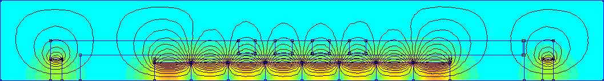
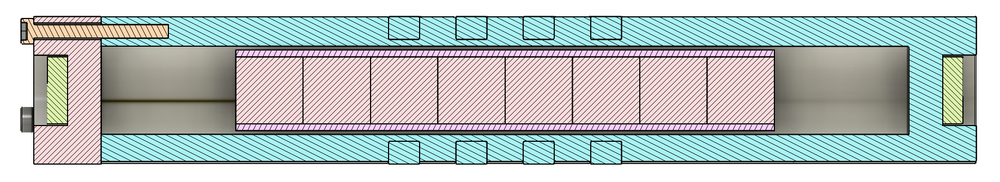

<!--
Color Palette:
- #F3F4F4
- #0DFDF7
-->

  
   
  <em>Axial Shake Powered Pill System – Electromechanical Design of the IsoPod by <a href="https://github.com/wgbowley">William Bowley</a></em>

--- 
The Hercules Challenge is a co-design consortium challenge available to first-semester, first-year engineers through the mandatory introductory class, "Introduction to Professional Engineering."

> [!IMPORTANT]
> `The Pantheon` consortium received a commendation award for their work on the `IsoPod` at the Hercules Challenge night at RMIT.

## Overview

The `IsoPod` is a pill system that reminds users when to take their medication through an e-ink display on the cylindrical bi-sector face of the device, providing a simple visual reminder.

This repository focuses on the design, simulation, construction, and validation of the `axial shake generator` (ASG) at the device's core. The generator converts intentional shaking motion into electrical energy via magnetic induction, which charges the IsoPod's Li-Po battery. This extends battery life, or with enough motion, can enable complete self-reliance.

### Why generate electrical?

In humanitarian contexts, reliable grid power isn't guaranteed, nor are reliable supply chains for expendable batteries. The ASG decouples the `IsoPod` from external infrastructure by converting user motion into electrical energy. Alongside this, the device helps compensate for human memory limitations through consistent and precise medication reminders tasks where embedded systems excel.

## Axial Shake Generator

  
  
<i>Figure 2: Cross-sectional analysis: <a href="01_simulation/parameters.uiv">Click here for parameters</a></i>

The generator consists of an armature (purple) made of poles (magnets), a stator (light blue) made of slots (coils), and restoring magnets which act as magnetic springs that allow the armature to build velocity from the user shaking the device with their forearm muscles.

### Electromagnetics

An ASG produces electricity via the interaction between a slot and a pole. When a pole moves axially through a slot, it produces an induced voltage within that slot due to the changing magnetic field generating a changing electric field. The direction of that field is opposite to the direction of motion of the pole. These ideas come together to form `Faraday's Law of Induction`:

$$V = -N\frac{d\Phi}{dt} \implies -\frac{d\lambda}{dt}$$

where $λ = N\Phi$ is the flux linkage between the slot and pole. Flux linkage can be thought of as the stickiness factor. The higher the linkage, the more the system resists changes. Luckily, using related rates, the two main parameters appear:

$$V_{\text{induced}} = -\frac{d\lambda}{dt} \implies -\frac{d\lambda}{dz} \cdot \frac{dz}{dt}$$

The first term is the derivative of flux linkage over the z-axis (magnetic design), and the second term is the z-axis velocity (mechanical input). These can be analytically approximated as:

> [!important]
> Flux linkage can be approximated analytically for intuition, while the final flux linkage is obtained by FEM.

$$\frac{dz}{dt} = A \omega \cos(\omega t + \phi)$$
$$\frac{d\lambda}{dz} = \frac{d}{dz} (\mu H \cos(z)) = -\mu H \sin(z)$$

These two derivatives expose the important mechanics of the system. Increasing acceleration `A` and frequency `ω` may increase induced voltage, but these are constrained by the user's physical abilities. Whereas the permeability `μ` and `H` may increase the induced voltage while generally not being constrained by the user's physical abilities.

Once induced voltage is established, the usable electrical power is determined by the generator's internal resistance:

$$P = \frac{V_{\text{rms}}^2}{R_{\text{internal}}}$$

This relationship drives one of the main trade-offs: increasing turns raises induced voltage but also increases resistance due to longer wire length. The optimal design maximizes `V^2/R`, not just peak voltage.

### Design