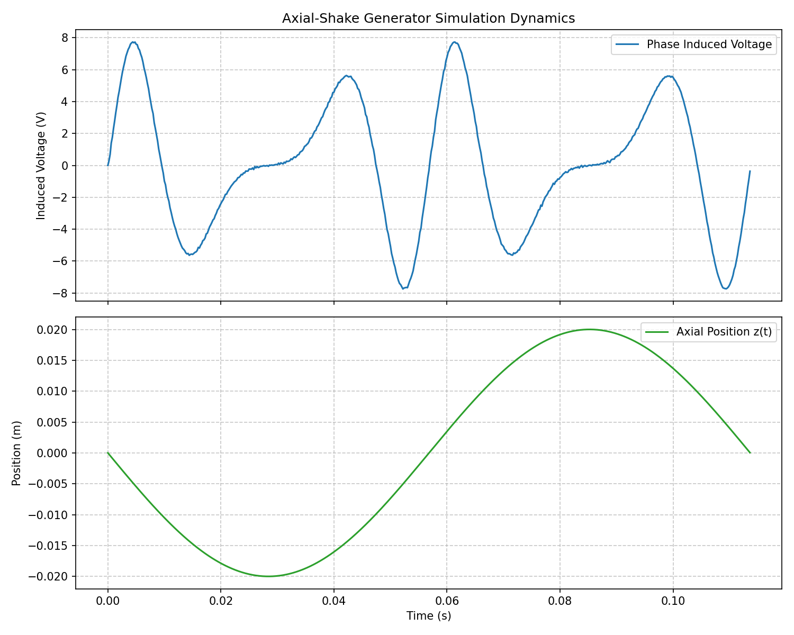

<!--
Color Palette:
- #F3F4F4
- #0DFDF7
-->

  
   
  <em>Axial Shake Powered Pill System – Electromechanical Design of the IsoPod by <a href="https://github.com/wgbowley">William Bowley</a></em>

--- 
The Hercules Challenge is a co-design consortium challenge available to first-semester, first-year engineers through the mandatory introductory class, "Introduction to Professional Engineering."

> [!IMPORTANT]
> `The Pantheon` consortium received a commendation award for their work on the `IsoPod` at the Hercules Challenge night at RMIT.

# Overview

The `IsoPod` is a pill system that reminds users when to take their medication through an e-ink display on the cylindrical bi-sector face of the device, providing a simple visual reminder.

This repository focuses on the design, simulation, construction, and validation of the `axial shake generator` (ASG) at the device's core. The generator converts intentional shaking motion into electrical energy via magnetic induction, which charges the IsoPod's Li-Po battery. This extends battery life, or with enough motion, can enable complete self-reliance.

### Why generate electrical?

In humanitarian contexts, reliable grid power isn't guaranteed, nor are reliable supply chains for expendable batteries. The ASG decouples the `IsoPod` from external infrastructure by converting user motion into electrical energy. Alongside this, the device helps compensate for human memory limitations through consistent and precise medication reminders, tasks where embedded systems excel.

# Axial Shake Generator

  
  
<i>Figure 1: Cross-sectional analysis: <a href="01_simulation/parameters.uiv">Click here for parameters</a></i>

The generator consists of an armature (purple) made of poles (magnets), a stator (light blue) made of slots (coils), and restoring magnets which act as magnetic springs that allow the armature to build velocity from the user shaking the device with their forearm muscles.

## Electromagnetics

An ASG produces electricity via the interaction between a slot and a pole. When a pole moves axially through a slot, it produces an induced voltage within that slot due to the changing magnetic field generating a changing electric field. The induced electric field opposes the change in magnetic flux that produced it, a consequence of Lenz's law. These ideas come together to form `Faraday's Law of Induction`:

$$V = -N\frac{d\Phi}{dt} \implies -\frac{d\lambda}{dt}$$

where $λ = N\Phi$ is the flux linkage between the slot and pole. Flux linkage can be thought of as the magnitude of how strongly the magnetic field links with the winding (turns in a slot). Higher linkage generally means the system can produce a larger induced voltage for the same change in armature position.

Luckily, using related rates, the two main parameters appear:

$$V_{\text{induced}} = -\frac{d\lambda}{dt} \implies -\frac{d\lambda}{dz} \cdot \frac{dz}{dt}$$

The first term is the derivative of flux linkage over the z-axis (magnetic design), and the second term is the z-axis velocity (mechanical input). These can be analytically approximated as:

> [!important]
> Flux linkage can be approximated analytically for intuition. The final flux linkage was obtained using Finite Element Analysis (FEA).

$$\frac{dz}{dt} = A \omega \cos(\omega t + \phi)$$
$$\frac{d\lambda}{dz} = \frac{d}{dz} (B \cos(z)) \implies -\mu H \sin(2\pi z)$$

> [!note]
> For a simple magnetic circuit, magnetic flux density can be related to magnetic field strength by `B = μH`, where `B` is the magnetic flux density, `H` is the magnetic field intensity, and `μ` is the permeability, the ability of a material to support magnetic flux.

These two derivatives expose the important mechanics of the system. Increasing acceleration `A` and frequency `ω` may increase induced voltage, but these are constrained by the user's physical abilities. Whereas the permeability `μ` and `H` may increase the induced voltage while generally not being constrained by the user's physical abilities.

Once induced voltage is established, the usable electrical power is determined by the generator's internal resistance:

$$P = \frac{V_{\text{rms}}^2}{R_{\text{internal}}}$$

This relationship drives one of the main trade-offs: increasing turns raises induced voltage but also increases resistance due to longer wire length. The optimal design maximizes `V^2/R`, not just peak voltage.

> [!important]
> The generator design was constrained by the IsoPod system requirements:
> - Cylindrical form factor: radial thickness < `12.5 mm`, height < `250 mm`
> - Human-powered input motion (reasonable frequency and acceleration)
> - Low-maintenance energy harvesting
> - Easy to construct with basic tools

## Design & Topology

  
  
<i>Figure 2: High level electrical machine topology</i>

> [!note]
> `N-S` represents an axially magnetized permanent magnet pole. `PA` represents phase A, where `PA+` and `PA-` indicate opposite winding directions.

The high-level topology in figure 2 was selected to enable oscillatory motion through magnetic restoring forces. The additional end poles act as magnetic springs, creating a restoring force when the armature approaches the limits of travel. This allows the armature to return towards the centre position after displacement.

The alternating pole arrangement (`N-S|S-N`) was selected because the transition between opposing poles creates a rapid change in magnetic field along the z-axis, increasing the spatial rate of change of flux linkage:

$$V \propto \frac{d\lambda}{dz}$$

A pole pitch of `10 mm` was selected, matching the pole length and maintaining direct magnetic coupling between adjacent opposing poles. The topology uses four stator slots interacting with four active armature poles, with additional poles placed on each end of the armature to increase usable travel distance. This allows approximately `20 mm` of positive and negative armature displacement while maintaining magnetic coupling between the armature and stator.

Maintaining slot overlap throughout the motion range produces a more consistent induced voltage waveform, where the primary amplitude is dominated by the mechanical velocity term:

$$V \propto \frac{dz}{dt}$$

The symmetric pole arrangement also reduces unwanted harmonic content compared with asymmetric topologies. Finally, no high-permeability materials were introduced into the armature or stator structure. The stator consists of copper windings, while the magnetic poles use `N52 Neodymium` permanent magnets.

## Numerical Model

> [!important]
> This area is recommended for individuals more familiar with electromagnetic finite element simulations.

The ASG was modelled using `FemmMagneticRender` (FEMM) with `shapely` for translating `PYFEA` CSG (constructive solid geometry) to FEMM native primitives. An axially symmetric coordinate system (z-r) was used due to the generator's rotational symmetry around its z-axis. A Dirichlet boundary condition was applied, with the radial boundary at `2×` the slot outer radius and the axial boundary at `1.2×` the stator tube length. The armature motion relative to the origin was simulated using:

$$ z = \text{travel} \cdot \sin(2\pi f t) $$

The resistance was obtained from `FemmMagneticSolver` during an initial configuration solve, and then the flux linkage was obtained per solve. Using the simulation time-step, the induced voltage was calculated using finite difference:

$$V_{\text{induced}} = -\frac{\lambda_{\text{new}} - \lambda_{\text{old}}}{t_{\text{step}}}$$

This was then used to calculate the RMS voltage, and using the generator's internal resistance, the expected power output was obtained. This method represents a `quasi-transient` method due to its use of asymptotic field conditions ($t=\infty$) per time step. This is reasonable due to the absence of highly magnetically permeable materials and the low operating frequency of the generator.

## Simulation Results

The parameter file can be found [here](01_simulation/parameters.uiv), written in `.uiv` (unit-informed values). The simulation files can be found [here](01_simulation), written in Python using the `pyfea` solver-adapter engine.

> [!IMPORTANT]
> The model was configured with the following parameters:
> - Temperature: `293.15 K`, Time step: `200 us`
> - Shaking Frequency: `8.8 Hz`, peak-to-peak travel: `40 mm`
> - Pole Coercivity: `956 kA/m`, Pole Permeability: `1.05 ∅`
> - Slot Conductivity: `60.07 MS/m`, Slot Permeability: `1.0 ∅`

  
  
<i>Figure 3: Simulated static |B| along the z-axis of the generator</i>

> [!IMPORTANT]
> The quasi-transient simulation predicted:
> - Time: `0.11 s`, Time steps: `568`
> - Peak voltage: `7.75 V`, RMS Voltage: `4.04 V` 
> - Resistance: `33.57 Ω`, Power: `0.49 W`

  
  
<i>Figure 4: Simulated induced voltage vs time and position vs time</i>

## Construction